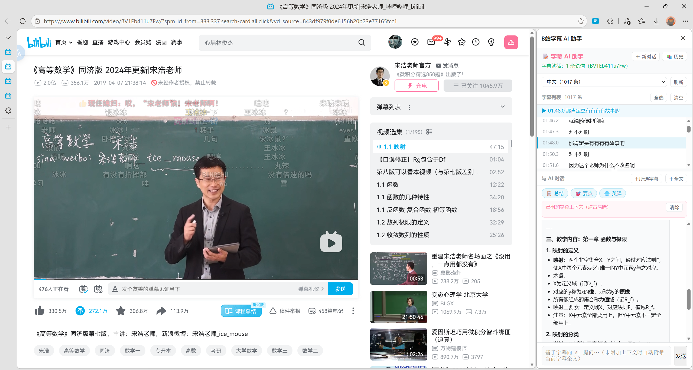
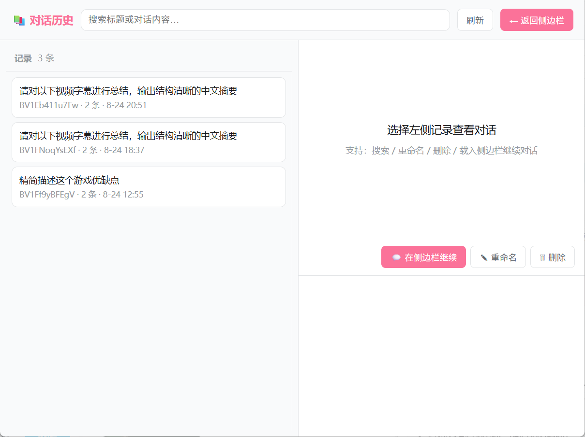

# 📝 B站字幕 AI 助手（bilibili-subtitle-ai）

> 一个让 B 站视频 **看得懂、聊得来、留得下** 的浏览器扩展：自动提取视频字幕，随播放同步滚动高亮，并基于字幕与 AI 对话（总结 / 要点 / 翻译 / 自由提问）。

[](https://github.com/) [](https://developer.chrome.com/docs/extensions) [](test/smoke-test.js) [](LICENSE)

---

## ✨ 亮点

| | 功能 | 说明 |
|---|---|---|
| 🎬 | **字幕自动提取** | 官方字幕轨道（CC / AI 字幕）自动识别，wbi 签名 + 双通道接口 + 30 分钟缓存；分P视频按 `?p=N` 精确对应字幕 |
| 📜 | **随播放同步滚动** | 侧边栏字幕随视频播放自动高亮（蓝色）并居中滚动，顶部“当前句”显示条实时更新，**双击字幕行跳转**视频 |
| 🤖 | **字幕 + AI 对话** | 发送提问自动附带当前字幕全文作为知识库；一键总结 / 要点 / 英译；流式输出、可中断 |
| 🧠 | **深度思考模式** | 可选 DeepSeek-R1 推理模型，先展示灰色“思考过程”，再输出正式回答 |
| 📝 | **Markdown 渲染** | AI 回复按 Markdown 渲染（代码块 / 标题 / 列表 / 引用 / 链接），安全转义 + 链接白名单 |
| 🗂️ | **对话历史管理** | 独立窗口管理：搜索、重命名、删除、载入侧边栏继续对话 |
| 🔄 | **SPA 智能跟随** | 站内切换分P / 推荐视频，字幕自动刷新（四通道 URL 检测 + 就绪通知） |
| 🎨 | **B 站原生风格** | 白底 + 品牌粉 #FB7299 + 经典蓝 #00A1D6，与 B 站视觉一致，不注入任何页面浮动元素 |

## 🖼️ 界面预览


| 侧边栏（字幕 + AI） | 历史管理窗口 |
|---|---|
|  |  |

## 🚀 快速开始

### 1. 安装扩展

```bash
git clone https://github.com/<你的用户名>/bilibili-subtitle-ai.git
```

1. Chrome / Edge 打开 `chrome://extensions`（Edge 为 `edge://extensions`）；
2. 右上角打开 **开发者模式**；
3. 点击 **加载已解压的扩展程序**，选择项目文件夹；
4. 固定扩展图标，打开任意 B 站视频页即可。

### 2. 配置 AI（首次必做）

1. 在 [platform.deepseek.com](https://platform.deepseek.com) 注册并创建 **API Key**；
2. 点击扩展图标 →「设置」：
   - **Base URL**：`https://api.deepseek.com`（任意 OpenAI 兼容端点均可，如通义、本地 Ollama）
   - **API Key**：粘贴你的 Key
   - **模型**：`deepseek-chat`（默认）
   - **思考等级**：普通 / **深度思考**（deepseek-reasoner，先推理再回答）
3. 点「测试连接」验证 →「保存设置」。

### 3. 开始使用

1. 打开 B 站视频页 → 点扩展图标 →「打开 AI 侧边栏」；
2. 字幕自动加载并随播放滚动；单击字幕行 = 加入 AI 上下文，**双击 = 跳转视频**；
3. 直接提问（如“总结这个视频”）：系统自动附带当前字幕全文；
4. 点「📚 历史」在独立窗口管理所有对话（搜索 / 重命名 / 删除 / 续聊）。

## 🧩 技术特性

- **Manifest V3**，零运行时依赖、零构建（纯原生 JavaScript，加载即用）
- **B 站字幕接口**：`x/player/wbi/v2` 带 **wbi 签名**（自实现 MD5 + mixinKey），失败自动回退 `x/player/v2`；`x/web-interface/view` 按 `?p=` 解析分P cid
- **登录态**：经 `chrome.cookies` 读取 B 站 Cookie，字幕请求携带 SESSDATA
- **AI 请求全部经 Service Worker**：API Key 永不出现在页面上下文；流式 SSE 转发 + AbortController 中断
- **稳定回归**：`test/smoke-test.js` 99 项断言（MD5/wbi 签名与 Node crypto 交叉验证、Markdown XSS 防护、资源完整性、消息链路存在性）

## 📁 目录结构

```
bilibili-subtitle-ai/
├── manifest.json            # MV3 清单
├── background.js            # Service Worker：wbi 字幕代理 / AI 流式代理 / 消息路由
├── content/
│   ├── extractor.js         # 视频识别（bvid/cid/?p）、SPA 四通道 URL 检测、字幕广播
│   └── subtitle-view.js     # 播放同步服务（无 UI）：高亮广播、跳转响应
├── lib/
│   ├── wbi.js               # MD5 / wbi 签名 / 字幕解析（纯函数，可单测）
│   └── markdown.js          # 零依赖 Markdown 渲染（XSS 转义 + 链接白名单）
├── sidepanel/               # AI 对话 + 字幕侧边栏
├── history/                 # 对话历史管理独立窗口
├── options/                 # AI 服务设置（Base URL / Key / 模型 / 思考等级）
├── popup/                   # 工具栏弹窗
├── assets/                  # 图标 16/48/128
├── test/smoke-test.js       # 冒烟测试（99 项）
├── docs/                    # ARCHITECTURE / DECISIONS / CHANGELOG / screenshots
└── PLAN.md                  # 开发计划
```

## 📚 文档

- [docs/ARCHITECTURE.md](docs/ARCHITECTURE.md) —— 架构说明与消息协议契约
- [docs/DECISIONS.md](docs/DECISIONS.md) —— 技术决策记录（ADR）与已知陷阱
- [docs/CHANGELOG.md](docs/CHANGELOG.md) —— 变更日志（0.1.0 → 0.7.1）
- [PLAN.md](PLAN.md) —— 开发计划

## 🧪 开发与测试

```bash
# 语法检查全部模块
for f in background.js lib/wbi.js lib/markdown.js content/*.js sidepanel/panel.js history/history.js options/options.js popup/popup.js; do node --check $f; done

# 冒烟测试（99 项）
node test/smoke-test.js
```

修改代码后回到 `chrome://extensions` 点扩展卡片的 **刷新** 重载。

## 📤 打包分发

```bash
cd ..
zip -r bilibili-subtitle-ai-v0.7.1.zip bilibili-subtitle-ai -x "*/test/*" "*/docs/screenshots/*"
```

## 🔒 隐私与安全

- API Key 仅保存在本地 `chrome.storage.local`，只在扩展 Service Worker 中用于请求；
- AI 请求仅发送用户主动选择/自动附加的字幕与提问内容；
- Markdown 渲染先 HTML 转义，链接仅放行 `http/https`；
- 扩展不收集、不上传任何用户数据。

## ⚠️ 已知限制

- 字幕来自 B 站官方接口，需**已登录**；无字幕 / 大会员专属视频可能无可用字幕；
- B 站接口偶有风控（HTTP 412），已内置自动重试；接口调整时需更新 `background.js`；
- Side Panel 需要 Chrome 116+。

## ❓ FAQ

**Q：为什么有的视频没有字幕？**
A：该视频本身没有 CC / AI 字幕轨道，扩展无能为力（面板会明确提示）。

**Q：切换分P / 推荐后字幕没变？**
A：确认扩展已刷新（v0.7.1+）。如仍异常，请打开侧边栏观察状态栏文字，并在 Issues 中反馈操作路径。

**Q：可以用其他 AI 服务吗？**
A：可以。任何 OpenAI 兼容端点（OpenAI、通义、Kimi、智谱、本地 Ollama 等）均可在设置页配置。

## 📄 License

[MIT](LICENSE) © 2025 bilibili-subtitle-ai contributors
