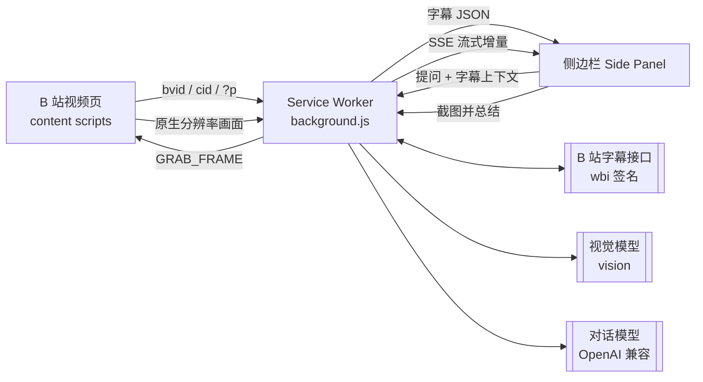

<!--
  发布到 GitHub 前，把下面所有的 your-name/bilibili-subtitle-ai 替换成你的实际仓库路径。
  可用一条命令批量替换（在仓库根目录执行）：
  sed -i 's#your-name/bilibili-subtitle-ai#你的用户名/仓库名#g' README.md
-->

<div align="center">


# B站字幕 AI 助手

**让 B 站视频看得懂、聊得来、留得下的浏览器扩展**

自动提取官方字幕 → 随播放同步高亮滚动 → 基于字幕与 AI 对话 → 一键截图让视觉模型读懂板书与公式

[](docs/CHANGELOG.md)
[](https://github.com/your-name/bilibili-subtitle-ai/actions/workflows/ci.yml)
[](https://developer.chrome.com/docs/extensions/develop/migrate)
[](docs/DECISIONS.md)
[](LICENSE)

[快速开始](#getting-started) · [功能](#features) · [工作原理](#how-it-works) · [FAQ](#faq) · [变更日志](docs/CHANGELOG.md) · [反馈问题](https://github.com/your-name/bilibili-subtitle-ai/issues)

</div>

<details>
<summary><b>English summary</b></summary>

A zero-dependency Manifest V3 extension for Chrome/Edge that pulls Bilibili's official subtitle tracks (wbi-signed API + fallback channel), renders them in a Side Panel with playback-synced highlighting and click-to-seek, and lets you chat with any OpenAI-compatible model using the transcript as context (summarize / outline / translate / free-form Q&A, streaming with interrupt).

It also grabs the **current video frame in-page** via `canvas.drawImage(video)` — native resolution, no danmaku or player chrome, and **no screenshot permission required** — sends it to a vision model to transcribe blackboards and LaTeX formulas, then lets you ask follow-up questions about that frame.

No build step, no bundler, no framework: clone it and load it unpacked. Your API key never leaves `chrome.storage.local` and is only used inside the service worker.

Chat defaults to DeepSeek `deepseek-v4-flash` with a six-step thinking dial (`off / low / medium / high / xhigh / max`) mapped onto the official `thinking` toggle and `reasoning_effort` parameter; any OpenAI-compatible endpoint works, and the DeepSeek-specific `thinking` field is only sent to DeepSeek targets.

</details>

---

<a id="features"></a>

## ✨ 功能

| 功能 | 说明 |
|---|---|
| 🎬 **字幕自动提取** | 自动识别官方 CC / AI 字幕轨道；wbi 签名 + 双通道接口 + 30 分钟缓存；分 P 视频按 `?p=N` 精确对应字幕 |
| 📜 **随播放同步滚动** | 侧边栏字幕随视频自动高亮并居中滚动，顶部「当前句」实时更新，**双击字幕行跳转**视频 |
| 🤖 **字幕 + AI 对话** | 提问自动附带当前字幕全文作为知识库；一键总结 / 要点 / 英译 / 大纲 / 笔记 / 术语；流式输出、随时中断 |
| 📸 **截图总结 + 追问** | 一键截取当前画面（**免额外权限**、视频原生分辨率、不含弹幕与播放器 UI），视觉模型识别板书与公式（LaTeX）并生成结构化总结；可围绕该画面多轮追问，也可连续截多张 |
| 🧠 **六档思考等级** | `off / low / medium / high / xhigh / max`（DeepSeek `thinking` + `reasoning_effort`），开启后先展示灰色「思考过程」再输出正式回答 |
| 📝 **Markdown + LaTeX** | 代码块 / 标题 / 列表 / 引用 / 链接完整渲染；`$...$`、`$$...$$` 公式渲染，模型漏写 `$` 的裸命令也能自动扶正 |
| 🗂️ **对话历史管理** | 独立窗口搜索、重命名、删除、载入侧边栏继续对话 |
| 🔄 **SPA 智能跟随** | 站内切换分 P / 推荐视频时字幕自动刷新（四通道 URL 检测 + 就绪通知） |
| 🎨 **B 站原生风格** | 白底 + 品牌粉 `#FB7299` + 经典蓝 `#00A1D6`；**不向页面注入任何浮动元素** |

<a id="preview"></a>

## 🖼️ 界面预览

| 侧边栏（字幕 + AI 对话） | 历史管理窗口 |
|---|---|
|  |  |

<a id="getting-started"></a>

## 🚀 快速开始

**前置条件**：Chrome 116+ 或同版本 Edge（Side Panel API）；一个 OpenAI 兼容的 API Key（费用由服务商向你计费）；B 站**已登录**（字幕接口需要登录态）。

### 1. 安装

```bash
git clone https://github.com/your-name/bilibili-subtitle-ai.git
```

> 也可以在 [Releases](https://github.com/your-name/bilibili-subtitle-ai/releases) 下载 zip 解压使用。**无需 npm install，无需构建。**

1. 打开 `chrome://extensions`（Edge 为 `edge://extensions`）
2. 右上角开启 **开发者模式**
3. 点 **加载已解压的扩展程序**，选择项目文件夹
4. 固定扩展图标，打开任意 B 站视频页

### 2. 配置模型

点扩展图标 →「设置」：

| 配置项 | 说明 |
|---|---|
| **Base URL** | `https://api.deepseek.com`，或任意 OpenAI 兼容端点（通义、Kimi、智谱、OpenAI、本地 Ollama…） |
| **API Key** | 仅保存在本地 `chrome.storage.local` |
| **模型** | 默认 `deepseek-v4-flash`；追求质量可换 `deepseek-v4-pro` |
| **思考等级** | 六档：`off / low / medium / high / xhigh / max`，默认 `high`（详见下表） |
| **🖼️ 视觉模型** | **使用「📸 截图总结」必填**：独立的 Base URL / Key / 模型（如 `qwen-vl-plus`，或 DeepSeek 的 `deepseek-v4-flash-vision-exp`），用于识别画面中的板书与公式 |

点「测试连接」验证 →「保存设置」。

#### 思考等级怎么选

思考等级对应 DeepSeek 的思考模式参数：`off` 发送 `{"thinking": {"type": "disabled"}}`，其余发送 `{"thinking": {"type": "enabled"}}` 加上 `{"reasoning_effort": "<等级>"}`。

| 设置值 | 发送的参数 | DeepSeek 实际生效 | 适用场景 |
|---|---|---|---|
| `off` | `thinking: disabled` | 不思考 | 翻译、提取要点，追求最快响应 |
| `low` | `reasoning_effort: low` | **low** | 日常总结、问答 |
| `medium` | `reasoning_effort: medium` | high（官方折叠） | 与 agent 分级对齐用 |
| `high` | `reasoning_effort: high` | **high** | 默认值，推荐 |
| `xhigh` | `reasoning_effort: xhigh` | high（官方折叠） | 与 agent 分级对齐用 |
| `max` | `reasoning_effort: max` | **max** | 复杂推导、数学证明 |

按官方映射（`deepseek-v4-flash` 与 `deepseek-v4-pro` 一致），`medium` 与 `xhigh` 都会被折叠到 `high`，因此真正有区别的是 **low / high / max** 三档；设置页会实时显示当前等级的实际生效值。

> 思考模式下 `temperature` 无效（官方文档明示），因此开启思考时扩展不会发送该参数 —— 只有思考等级为 `off` 时温度才起作用。

### 3. 使用

1. B 站视频页 → 点扩展图标 →「打开 AI 侧边栏」
2. 字幕自动加载并随播放滚动；**单击**字幕行 = 加入 AI 上下文，**双击** = 跳转视频
3. 直接提问（如「总结这个视频」），系统自动附带当前字幕全文
4. 讲到关键板书时切到「📸 截图总结」→ 点「📷 截图并总结」→ 可围绕这张画面继续追问
5. 点「📚 历史」在独立窗口管理全部对话

<a id="how-it-works"></a>

## 🧩 工作原理



- **Manifest V3**，纯原生 JavaScript，零运行时依赖、零构建，加载即用
- **字幕接口**：`x/player/wbi/v2` 带 **wbi 签名**（自实现 MD5 + mixinKey），失败自动回退 `x/player/v2`；`x/web-interface/view` 按 `?p=` 解析分 P cid
- **登录态**：字幕请求统一 `credentials: "include"` 由浏览器携带 SESSDATA（`Cookie` 头无法由扩展脚本设置）；`chrome.cookies` 仅用于探测是否已登录
- **AI 请求全部经 Service Worker**：API Key 永不出现在页面上下文；SSE 流式转发 + `AbortController` 中断
- **思考模式**：按 DeepSeek 文档发送 `thinking` 开关 + `reasoning_effort` 强度，思考链经 `reasoning_content` 与正文分离渲染；非 DeepSeek 端点自动不发 `thinking`，若端点明确拒绝这两个字段则去掉后重试一次
- **配置只有一份实现**：默认值、旧配置迁移与请求体构造统一在 `lib/settings.js`，Service Worker、设置页与 Node 冒烟测试三处共用，不会出现两份默认值漂移
- **截图免权限**：优先在页面内 `canvas.drawImage(video)` 抓帧（含全黑帧探测）；仅当画布被跨域污染时才回退 `captureVisibleTab`，该路径所需的 `<all_urls>` 是**可选权限**，默认不申请
- **回归测试**：`test/smoke-test.js` —— MD5/wbi 签名与 Node crypto 交叉验证、字幕归一化容错、Markdown/LaTeX 渲染与 XSS 防护、资源完整性、消息链路存在性；每次 push 由 GitHub Actions 运行

<a id="permissions"></a>

## 🔐 权限与隐私

| 权限 | 用途 |
|---|---|
| `sidePanel` | 打开 AI 侧边栏 |
| `storage` | 保存设置、对话历史与字幕缓存 |
| `cookies` | 探测 B 站登录态（SESSDATA） |
| `tabs` | 识别当前 B 站视频标签页 |
| `activeTab` | 整页截图兜底（仅在直接抓帧被跨域保护时用到） |
| host permissions | 访问 B 站接口与你配置的 AI 服务 |
| `<all_urls>` | **可选，默认不申请**：整页截图兜底，需在设置页手动授予 |

- API Key 仅存于本地 `chrome.storage.local`，只在扩展 Service Worker 内使用
- 仅发送你主动选择或自动附加的字幕与提问内容；**扩展本身不收集、不上传任何数据**
- 使用第三方兼容 API 时，字幕与提问会发送给该服务商 —— 请自行确认其隐私政策
- Markdown 渲染先做 HTML 转义，链接仅放行 `http/https`

<a id="faq"></a>

## ❓ FAQ

<details>
<summary><b>为什么有的视频没有字幕？</b></summary>

该视频本身没有 CC / AI 字幕轨道，扩展无能为力（面板会明确提示）。另外字幕接口需要**已登录**，未登录时部分视频会返回空轨道。

</details>

<details>
<summary><b>切换分 P / 推荐视频后字幕没变？</b></summary>

先确认扩展已刷新到最新版本。如仍异常，打开侧边栏观察状态栏文字，并在 Issues 中附上操作路径与视频链接。

</details>

<details>
<summary><b>可以用其他 AI 服务吗？</b></summary>

可以。任何 OpenAI 兼容端点都行：OpenAI、通义千问、Kimi、智谱、本地 Ollama 等，在设置页填 Base URL 即可。对话模型与视觉模型可以配置成两家不同的服务。

`thinking` 字段是 DeepSeek 的扩展参数，因此只在 Base URL 或模型名含 `deepseek` 时发送。若某个兼容端点仍返回 400 并明确抱怨 `thinking` 或 `reasoning_effort`，扩展会自动去掉思考参数、补回 `temperature` 重试一次，你不需要手动改配置。

</details>

<details>
<summary><b>从 0.10.x 升级后要重新配置模型吗？</b></summary>

不需要。旧的 `deepseek-chat` / `deepseek-reasoner` 已被 DeepSeek 下线，扩展在读取设置时会自动改写为 `deepseek-v4-flash`；旧的两档「思考等级」也会自动迁移（深度思考 → `high`，普通 → `off`）。想用更强的模型可手动改成 `deepseek-v4-pro`。

</details>

<details>
<summary><b>为什么调了温度没效果？</b></summary>

思考模式下 `temperature`、`top_p`、`presence_penalty`、`frequency_penalty` 都不生效，这是 DeepSeek 官方文档明确说明的（设置不报错但也不起作用）。扩展因此在开启思考时干脆不发送这些参数。把思考等级设为 `off`，温度就会重新生效。

</details>

<details>
<summary><b>截图报 <code>Either the '&lt;all_urls&gt;' or 'activeTab' permission is required.</code></b></summary>

v0.10.1 已修复：截图改为直接读取播放器视频帧，不再需要截图权限。请到 `chrome://extensions` 点扩展卡片的**刷新**重载扩展，并**刷新 B 站视频页**（content script 需重新注入）。若提示「视频帧被跨域保护」，再到设置页「📷 截图兜底权限」点授予即可。

</details>

<details>
<summary><b>截图总结提示未配置视觉模型？</b></summary>

「截图总结」的核心是画面识别，不会静默退化成纯字幕总结。请在设置页「🖼️ 视觉模型」单独填写 Base URL / API Key / 模型。

</details>

<a id="limitations"></a>

## ⚠️ 已知限制

- 字幕来自 B 站官方接口，需已登录；无字幕或大会员专属视频可能无可用字幕
- B 站接口偶有风控（HTTP 412），已内置分级重试；接口调整时需更新 `background.js`
- Side Panel 需要 Chrome 116+
- 未上架 Chrome 应用商店，目前以开发者模式加载

<a id="development"></a>

## 🛠️ 开发

```bash
# 语法检查全部模块
for f in background.js lib/*.js content/*.js sidepanel/panel.js history/history.js options/options.js popup/popup.js; do node --check "$f"; done

# 冒烟测试
node test/smoke-test.js

# 打包分发（在仓库外层目录执行）
cd .. && zip -r bilibili-subtitle-ai-v0.11.0.zip bilibili-subtitle-ai -x "*/test/*" "*/docs/screenshots/*" "*/.git/*"
```

改完代码回到 `chrome://extensions` 点扩展卡片的 **刷新**；改了 content script 还需刷新 B 站页面。

<details>
<summary><b>目录结构</b></summary>

```
bilibili-subtitle-ai/
├── manifest.json            # MV3 清单
├── background.js            # Service Worker：wbi 字幕代理 / AI 流式代理 / 截图路由
├── content/
│   ├── extractor.js         # 视频识别（bvid/cid/?p）、SPA 四通道 URL 检测、字幕广播
│   └── subtitle-view.js     # 播放同步服务（无 UI）：高亮广播、跳转、GRAB_FRAME 抓帧
├── lib/
│   ├── wbi.js               # MD5 / wbi 签名 / 字幕解析（纯函数，可单测）
│   ├── settings.js          # 设置默认值 / 旧配置迁移 / 思考等级 / 请求体构造（纯函数）
│   ├── sse.js               # SSE 流解析纯函数
│   ├── latex.js             # 零依赖迷你 LaTeX→HTML 渲染
│   └── markdown.js          # 零依赖 Markdown 渲染（XSS 转义 + 链接白名单）
├── sidepanel/               # 字幕 + AI 对话 + 截图总结
├── history/                 # 对话历史管理独立窗口
├── options/                 # 模型设置、视觉模型、截图兜底权限
├── popup/                   # 工具栏弹窗
├── assets/                  # 图标 16/48/128
├── test/smoke-test.js       # 冒烟测试（CI 运行）
└── docs/                    # ARCHITECTURE / DECISIONS / CHANGELOG / FEATURE-* / screenshots
```

</details>

<details>
<summary><b>设计文档</b></summary>

- [docs/ARCHITECTURE.md](docs/ARCHITECTURE.md) —— 模块划分与消息协议契约
- [docs/DECISIONS.md](docs/DECISIONS.md) —— 技术决策记录（ADR）与已知陷阱
- [docs/CHANGELOG.md](docs/CHANGELOG.md) —— 变更日志（0.1.0 → 0.11.0）
- [docs/FEATURE-SHOT-SUMMARY.md](docs/FEATURE-SHOT-SUMMARY.md) —— 截图总结设计（数据流 / UI / 决策）
- [PLAN.md](PLAN.md) —— 开发计划

**先读 `docs/DECISIONS.md` 再动手改**：里面记录了「为什么不能设 `Cookie` 头」「为什么不用 `captureVisibleTab`」这类踩过的坑。

</details>

<a id="contributing"></a>

## 🤝 参与贡献

欢迎 Issue 与 PR。提交前请确保：

1. `node test/smoke-test.js` 全绿，且新行为补了断言
2. 所有模块 `node --check` 通过（CI 会跑同一份清单）
3. 不引入任何运行时依赖与构建步骤（见 `docs/DECISIONS.md` D1）
4. 改了行为就同步更新 `docs/CHANGELOG.md` 与 `manifest.json` 版本号

反馈 Bug 时请附上：浏览器与版本、扩展版本、视频链接、复现步骤，以及侧边栏 / Service Worker 控制台的报错。

## 📄 免责声明

本项目为非官方的第三方工具，与哔哩哔哩（bilibili.com）无任何关联。仅调用 B 站公开的网页接口获取**你当前账号已可访问**的字幕内容，请遵守 B 站用户协议；字幕与视频内容版权归原作者及平台所有，请勿用于侵权用途。AI 服务的调用费用由你与所选服务商结算。

## License

[MIT](LICENSE) © 2025 bilibili-subtitle-ai contributors

<div align="center">

如果这个扩展帮到了你，欢迎点一个 ⭐️

</div>
